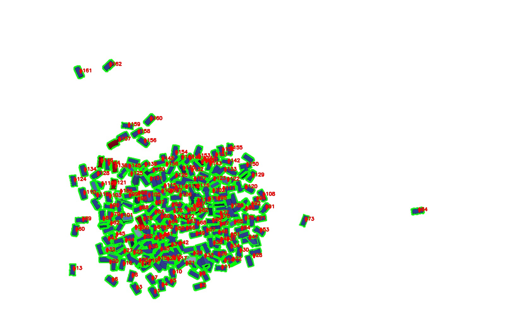

# Particle Detection & Segmentation 🔬


Classical **computer-vision pipeline** for detecting, separating, and measuring particles
in microscopy-style images. It compares three segmentation strategies, labels every detected
particle with an ID, and exports per-object metrics (area, centroid, bounding box) to CSV.

## Results

| Input | Watershed separation | Labelled output |
|-------|----------------------|-----------------|
|  |  |  |

Side-by-side comparison of all methods:


## The three approaches

| Method | Idea | Best for |
|--------|------|----------|
| **Boundary refinement** (`refine_boundaries`) | Threshold + morphology + contour cleanup | Well-separated, high-contrast particles |
| **Watershed** (`watershed_refinement`) | Distance transform + watershed to split touching blobs | Clustered / overlapping particles |
| **Colour-based** (`color_based_segmentation`) | HSV colour-range masking per class | Particles distinguished by colour |

Each method outputs an annotated image, a filled mask, and a `*_metrics.csv` with per-particle
measurements (see `save_to_csv`). `process_image()` ties them together and can run any subset
of methods on an input image.

## Run it

```bash
pip install -r requirements.txt

# from the repo root
python "Iteration Wise Script/finals.py"
```

Edit the `image_path` / `output_dir` at the bottom of `finals.py` (or call
`process_image(image_path, output_dir, methods=[...])`) to run on your own images.

## Repository layout

```
Iteration Wise Script/
  finals.py            # main pipeline: 3 segmentation methods + CSV metrics export
  WatershedAlgo.py     # standalone watershed experiment
  decv.py              # earlier iteration / scratch experiments
Iteration Wise Photos/ # intermediate outputs captured while iterating
es3 (1)_*.jpg          # sample inputs and per-method result images
*_metrics.csv          # exported per-particle measurements
```

## License

MIT — see [LICENSE](LICENSE).
